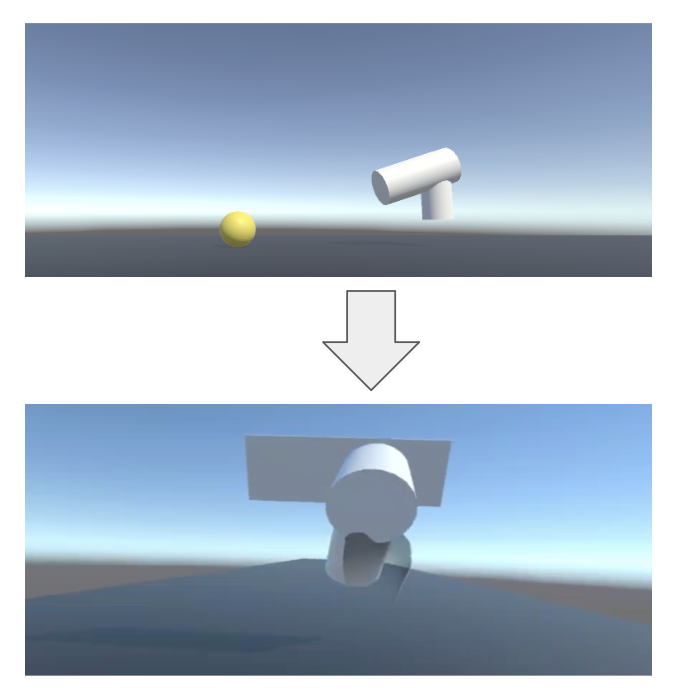

**Settling for an idea: Moving the player with a ventilator**

After researching different modes of locomotion in animals and also taking some time with the idea to implement locomotion as it is presented in the Video Game form the Movie "Her", I finally settled for a totally different idea inspired by the artwork "Objective Realities".

"Objective Ralities" is an immersive installation by the artist collective automata.farm in collaboration with the science fiction authorBruce Sterling. I got to see it on a vacation in Vienna when I was visiting the Museum für Angewandte Kunst. There were three different objects made from white plastic: A ventilator, a vacuum-cleaning robot and a plug. Those hold VR-glasses inside that enabled visitors to immerse in the daily lifes of those objects. For example, putting the ventilator one's top of your head, people could blew around papar and move the curtains in a virtual living room. At the same time, a monologue of the object was played as audio.

Background information about the project and a video showing the artwork in action can be found [here](https://www.wired.com/beyond-the-beyond/2018/08/automata-farm-objective-reality/). A interview with automata.farm can be read [here](https://speculativeedu.eu/interview-automato-farm/).

 For the implementation of the interaction project I now want to use a ventilator or handheld fan to create directed wind to move the player. Following the physics of wind, the player would move to the left if the ventilator is blowing wind from right side. The direction would be controlled by adjusting the angle in which the ventilator is positioned in relation to the player.
 
 
 

